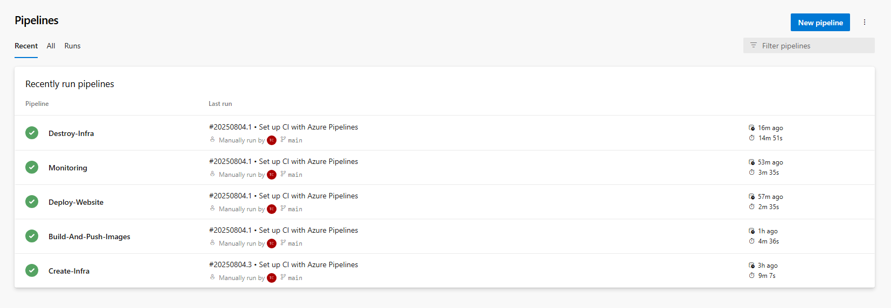
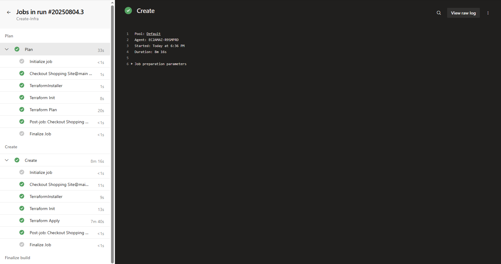
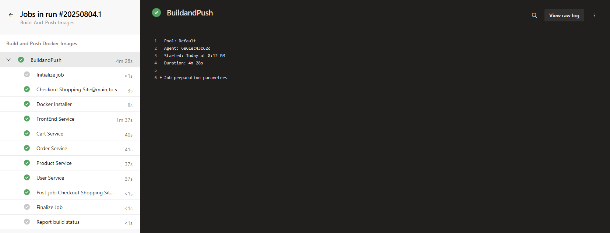
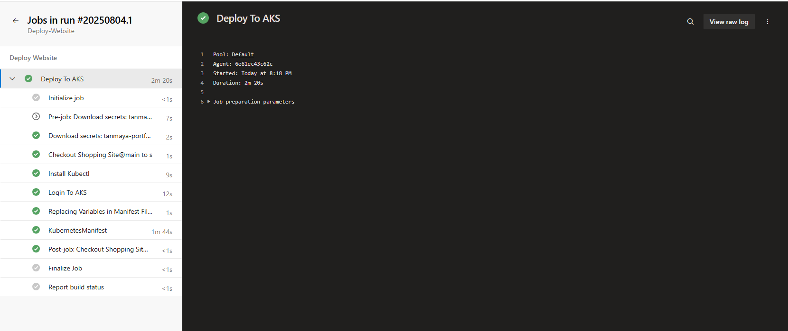
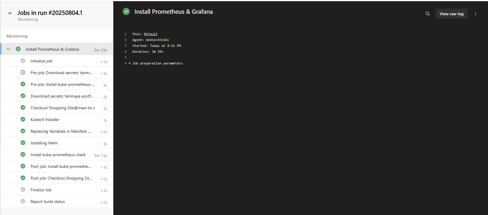
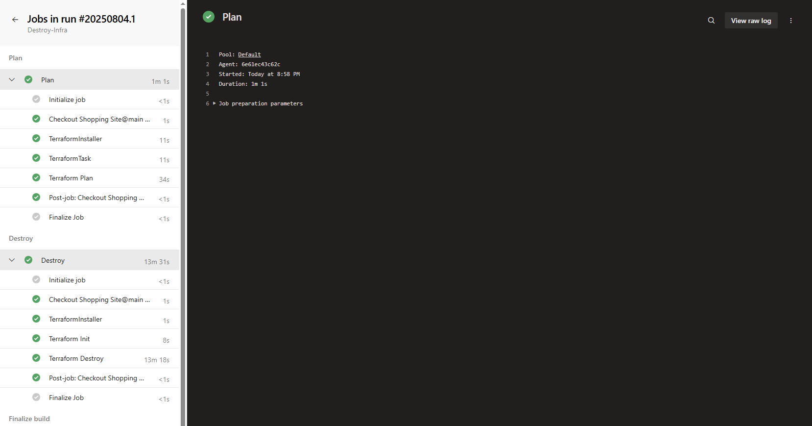
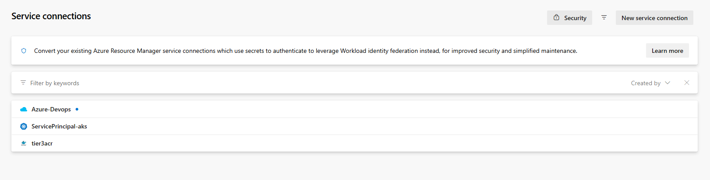
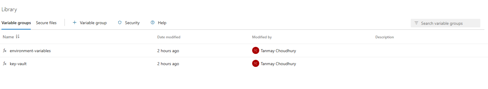
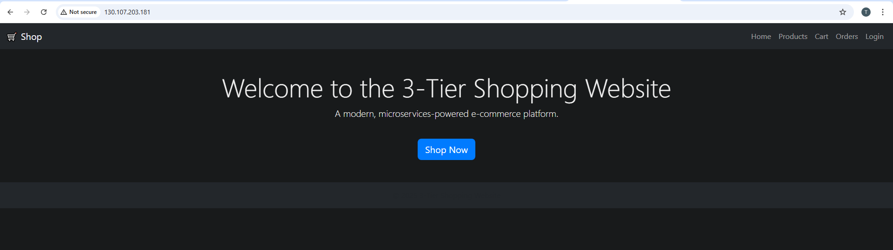
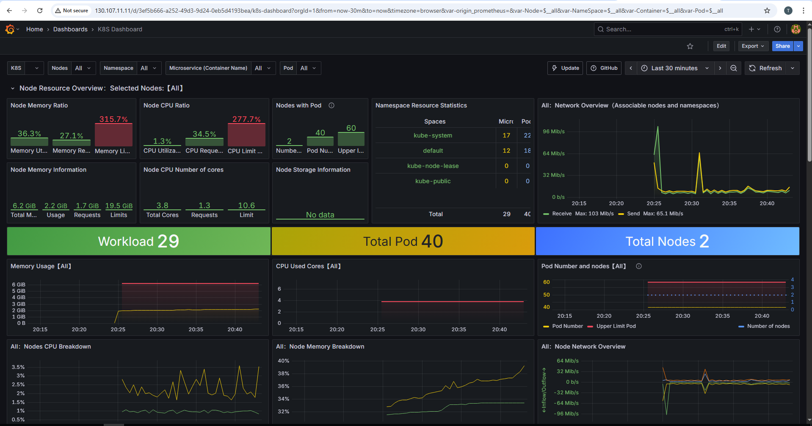

# Cloud-Native Shopping Site Infrastructure

This project provides a complete infrastructure-as-code (IaC) and Kubernetes-based deployment solution for a cloud-native shopping site. The main focus is on scalable, secure, and observable infrastructure using Terraform, Kubernetes, and automated CI/CD pipelines with integrated monitoring.

## Table of Contents
- [Overview](#overview)
- [Technologies Used](#technologies-used)
- [Repository Structure](#repository-structure)
- [Infrastructure Provisioning (Terraform)](#infrastructure-provisioning-terraform)
- [Kubernetes Manifests](#kubernetes-manifests)
- [CI/CD & Monitoring](#cicd--monitoring)
- [Getting Started](#getting-started)
- [Contributing](#contributing)
- [License](#license)

---

## Overview

This repository demonstrates how to:
- Provision cloud infrastructure (e.g., Azure AKS, Key Vault, Service Principals) using Terraform modules
- Deploy workloads to Kubernetes using declarative YAML manifests
- Automate build, deployment, and monitoring with CI/CD pipelines
- Enable robust monitoring with Prometheus and Grafana, automatically installed via pipeline


## Technologies Used

- **Terraform**: Infrastructure as Code (IaC) for cloud resource provisioning
- **Kubernetes (k8s)**: Container orchestration and workload management
- **Helm**: Package manager for Kubernetes (used for monitoring stack)
- **Prometheus & Grafana**: Monitoring and visualization
- **Azure AKS**: Managed Kubernetes cluster (example cloud provider)
- **CI/CD**: Azure Pipelines (YAML workflows)

## Repository Structure

```
Deployment/             # CI/CD and monitoring pipelines (Build.yml, Deploy.yml, Monitoring.yml)
Infra-Provisioning/     # Terraform automation pipelines (Create-infra.yml, Destroy-infra.yml)
k8s/                    # Kubernetes manifests (deployments, services, configmaps, secrets, ingress)
modules/
  aks-cluster/          # AKS cluster Terraform module
  keyvault/             # Key Vault Terraform module
  service-principal/    # Service Principal Terraform module
Terraform/              # Root Terraform configuration (backend.tf, main.tf, provider.tf, etc.)
website/                # Dummy website and microservice folders (not the focus)
screenshots/            # Screenshots for documentation
```

## Infrastructure Provisioning (Terraform)

- **Terraform/**: Contains main configuration, providers, variables, and outputs for the environment
- **modules/**: Reusable modules for AKS, Key Vault, and Service Principals
- **Infra-Provisioning/**: Scripts to create and destroy infrastructure using the above modules

### Key Steps
1. Configure variables in `Terraform/terraform.tfvars`
2. Run `Create-infra.yml` in `Infra-Provisioning/` to provision resources
3. Run `Destroy-infra.yml` to tear down resources when needed

## Kubernetes Manifests

- **k8s/**: Contains all YAML manifests for deploying workloads, services, configmaps, secrets, and ingress resources
- Includes monitoring-related manifests and namespaces

## CI/CD & Monitoring

- **Deployment/Build.yml** and **Deployment/Deploy.yml**: Automate build and deployment of workloads
- **Deployment/Monitoring.yml**: Pipeline automates installation of Prometheus and Grafana using Helm
    - Installs `kube-prometheus-stack` chart
    - Configures Prometheus as ClusterIP and Grafana as LoadBalancer
    - Sets Grafana admin password from pipeline secret
- Monitoring is enabled for all workloads via the CI/CD pipeline, providing observability out-of-the-box


### All Pipelines Overview


### Infra Provisioning Pipeline


### Build Pipeline


### Deploy Pipeline


### Monitoring Pipeline


### Destroy Infra Pipeline


### Grafana Dashboard


### Service Accounts created for pipelines


### Variable Groups used in pipelines


## Getting Started

1. **Provision Infrastructure**
    - Edit `Terraform/terraform.tfvars` with your environment details
    - Run the provisioning pipeline or scripts in `Infra-Provisioning/`
2. **Build & Push Docker Images**
    - Build images for your workloads (if any)
    - Push to your container registry
3. **Deploy to Kubernetes**
    - Apply manifests in `k8s/` to your cluster
4. **Enable Monitoring**
    - The monitoring stack (Prometheus & Grafana) is automatically installed via the CI/CD pipeline
    - Access Grafana via the LoadBalancer service endpoint


### Website Home Page


### Grafana Home Page



